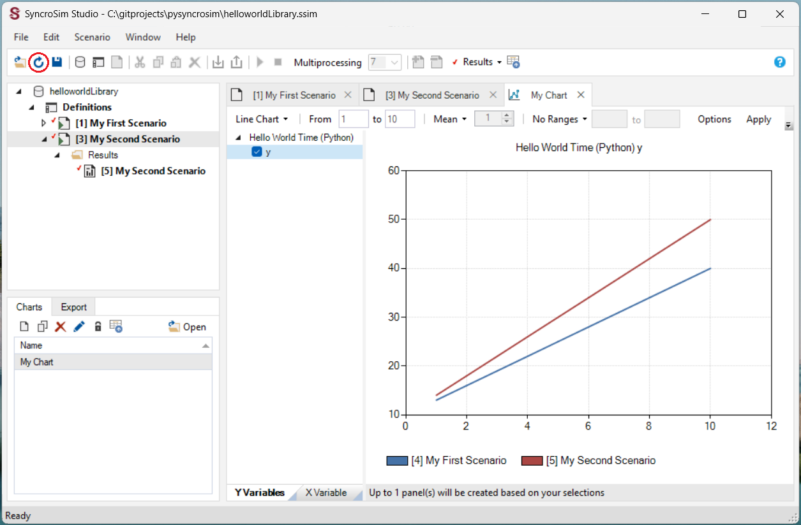

Quickstart
==========
``pysyncrosim`` is the Python interface to the `SyncroSim software framework`_, a program that structures and models your data. This tutorial will cover the basics of using the ``pysyncrosim`` package within the SyncroSim software framework.

	.. _SyncroSim software framework: https://syncrosim.com
	
To complete this tutorial, you must `install SyncroSim`_ and `install pysyncrosim`_. You will also need to install the `helloworldTimePy`_ SyncroSim Package.

	.. _install SyncroSim: https://syncrosim.com/download/
	.. _install pysyncrosim: https://pysyncrosim.readthedocs.io/en/latest/install.html
	.. _helloworldTimePy: https://apexrms.github.io/helloworldEnhanced/

Overview of SyncroSim
---------------------
`SyncroSim`_ is a software platform that helps you turn your data into forecasts. At the core of SyncroSim is an engine that automatically structures your existing data, regardless of its original format. SyncroSim transforms this structured data into forecasts by running it through a Pipeline of calculations (i.e. a suite of models). Finally, SyncroSim provides a rich interface to interact with your data and models, allowing you to explore and track the consequences of alternative “what-if” forecasting Scenarios. Within this software framework is the ability to use and create SyncroSim packages.

	.. _SyncroSim: https://syncrosim.com

For more details consult the `SyncroSim online documentation`_.

    .. _SyncroSim online documentation: https://docs.syncrosim.com/

Overview of ``pysyncrosim``
---------------------------
``pysyncrosim`` is a Python package designed to facilitate the development of modeling workflows for the SyncroSim software framework. Using the ``pysyncrosim`` interface, simulation models can be added and run through SyncroSim to transform Scenario-based datasets into model forecasts. This Python package takes advantage of general features of SyncroSim, such as defining Scenarios with spatial or non-spatial inputs, running Monte Carlo simulations, and summarizing model outputs. 

``pysyncrosim`` requires SyncroSim 2.3.10 or higher.

SyncroSim Package: `helloworldTimePy`
-----------------------------------
`helloworldTimePy`_ was designed to be a simple package to show off some key functionalities of SyncroSim, including the ability to add timesteps to SyncroSim modeling workflows.

	.. _helloworldTimePy: https://apexrms.github.io/helloworldEnhanced/

The package takes from the user two inputs, *m* and *b*, representing a slope and an intercept value. It then runs these input values through a linear model, *y=mt+b*, where *t* is *time*, and returns the *y* value as output.

    .. image:: img/infographic-basic.png

Set Up
------

Install SyncroSim
^^^^^^^^^^^^^^^^^
Before using ``pysyncrosim``, you will first need to `download and install`_ the SyncroSim software. Versions of SyncroSim exist for both Windows and Linux.

    .. _download and install: https://syncrosim.com/download/

Installing and Loading Python Packages
^^^^^^^^^^^^^^^^^^^^^^^^^^^^^^^^^^^^^^
Install ``pysyncrosim`` using either ``conda install`` or ``pip install``. See the `Installation`_ page for more detailed installation instructions.

    .. _Installation: https://pysyncrosim.readthedocs.io/en/latest/install.html

Then, in a new Python script, import ``pysyncrosim`` and the Python DataFrame manipulation package, ``pandas``.

.. code-block:: pycon

    >>> from osgeo import gdal
    >>> import pysyncrosim as ps
    >>> import pandas as pd
    
Connecting Python to SyncroSim 
^^^^^^^^^^^^^^^^^^^^^^^^^^^^^^
The next step in setting up the Python environment for the ``pysyncrosim`` workflow is to create a SyncroSim Session instance in Python that provides the connection to your installed copy of the SyncroSim software. A new Session is created using the :class:`~pysyncrosim.session.Session()` class. The Session can be initialized with a path to the folder on your computer where SyncroSim has been installed. If no arguments are specified when the Session class is initialized, then the default install folder is used (Windows only).

.. code-block:: pycon

   # Load Session
   >>> my_session = ps.Session()
   
   # Load Session using path to SyncroSim Installation
   >>> my_session = ps.Session(location = "path\\to\\install_folder")
   
You can check to see which version of SyncroSim your Python script is connected to by running the :meth:`~pysyncrosim.session.Session.version()` method.
 
.. code-block:: pycon
   
   # Check SyncroSim version
   >>> my_session.version() 
   'Version is: 3.0.4'
   
Installing SyncroSim Packages
^^^^^^^^^^^^^^^^^^^^^^^^^^^^^
Finally, check if the ``helloworldTimePy`` package is already installed. Use the :meth:`~pysyncrosim.session.Session.packages()` method to first get a list of all currently installed SyncroSim Packages.
   
.. code-block:: pycon
   
    # Check which SyncroSim Packages are installed
    >>> my_session.packages()
    Empty DataFrame
    Columns: [index, Name, Description, Version, Extends]
    Index: [] 
    
Currently we do not have any packages installed! To see which packages are available from the SyncroSim package server, you can use the ``installed = False`` argument in the :meth:`~pysyncrosim.session.Session.packages()` method.

.. code-block:: pycon

    # Check out available SyncroSim Packages
    >>> available_packages = my_session.packages(installed=False)
    >>> available_packages['Name']
    0                burnP3Plus
    1       burnP3PlusCell2Fire
    2      burnP3PlusPrometheus
    3                 demosales
    4                     dgsim
    5                helloworld
    6          helloworldTimePy
    7                 omniscape
    8                     stsim
    9               stsimecodep
    10                    wisdm
    Name: Name, dtype: object
    
Install ``helloworldTimePy`` using the :meth:`~pysyncrosim.session.Session.add_packages()` method from the Session class. This method takes a Package name as input and then queries the SyncroSim Package server for the specified Package.

.. code-block:: pycon
           
   # Install helloworldTimePy Package
   >>> my_session.install_packages("helloworldTimePy")
   ['helloworldTimePy'] installed successfully
   
To install a package from a *.ssimpkg* file on your local computer rather than installing directly from the server, you can use the Session :meth:`~pysyncrosim.session.Session.add_packages()` method with the ``packages`` argument set to the filepath to the local Package.
   
.. code-block:: pycon

    # Install helloworldTimePy Package locally
    >>> my_session.install_packages("path/to/helloworldTimePy.ssimpkg")

Now ``helloworldTimePy`` should be included in the Package list.

.. code-block:: pycon

   >>> my_session.packages()
           index                Name                                       Description Version Extends 
        0      0    helloworldTimePy Example demonstrating how to use timesteps wit...   1.0.0     NaN 
        
You can also update or remove a SyncroSim Package from your Session using the :meth:`~pysyncrosim.session.Session.update_packages()` method or the :meth:`~pysyncrosim.session.Session.remove_packages()` method.

.. code-block:: pycon
   
   # Uninstall installed packages 
   >>> my_session.uninstall_packages("myPackage")
   
Create a Modeling Workflow
--------------------------
When creating a new modeling workflow from scratch, we need to create class instances of the following scopes:

* `Library`_
* `Project`_
* `Scenario`_

    .. _Library: https://docs.syncrosim.com/how_to_guides/library_overview.html
    .. _Project: https://docs.syncrosim.com/how_to_guides/library_overview.html
    .. _Scenario: https://docs.syncrosim.com/how_to_guides/library_overview.html
   
These classes are hierarchical, such that a Library can contain many Projects, and each Project can contain many Scenarios. All parameters or configurations set in a Library are inherited by all Projects within the Library, and all parameters or configurations set in a Project are inherited by all Scenarios within that Project.

Create a New Library
^^^^^^^^^^^^^^^^^^^^
A SyncroSim `Library`_ is a file (with *.ssim* extension) that stores all of your model inputs and outputs. The format of each SyncroSim Library is unique to the SyncroSim Package with which it is associated. We create a new Library class instance using :func:`~pysyncrosim.helper.library()` that is connected (through your Session) to a SyncroSim Library file.

    .. _Library: https://docs.syncrosim.com/how_to_guides/library_overview.html

.. code-block:: pycon

    # Create a new Library
    >>> my_library = ps.library(name = "helloworldLibrary",
    >>>                        session = my_session, 
    >>>                        packages = "helloworldTimePy")
    Package <helloworldTimePy v2.0.0> added
    
    # Check Library information
    >>> my_library.info   
           Property                                              Value
0             Name:                                  helloworldLibrary
1            Owner:                                                NaN
2        Read Only:                                                 No
3    Last Modified:                              2024-08-28 at 4:17 PM
4             Size:                                216 KB  (221,184 B)
5       Data files:                        helloworldLibrary.ssim.data
6    Publish files:                     helloworldLibrary.ssim.publish
7  Temporary files:                        helloworldLibrary.ssim.temp
8     Backup files:                      helloworldLibrary.ssim.backup
9        Use Conda:                                                 No
    
We can also use the :func:`~pysyncrosim.helper.library()` function to open an existing Library. For instance, now that we have created a Library called "helloworldLibrary.ssim", we would simply specify that we want to open this Library using the ``name`` argument.    

.. code-block:: pycon

    # Open existing Library
    >>> my_library = ps.library(name = "helloworldLibrary")
                           
Note that if you want to create a new Library file with an existing Library name rather than opening the existing Library, you can use ``overwrite=True`` when initializing the Library class instance.

Create a New Project
^^^^^^^^^^^^^^^^^^^^
Each SyncroSim Library contains one or more SyncroSim `Projects`_, each represented by an instance of class Project in ``pysyncrosim``. Projects typically store model inputs that are common to all your Scenarios. In most situations you will need only a single Project for your Library; by default each new Library starts with a single Project named "Definitions" (with a unique ``project_id`` = 1). The :meth:`~pysyncrosim.library.Library.projects()` method of the Libarry class is used to both create and retrieve Projects for a specific Library.

    .. _Projects: https://docs.syncrosim.com/how_to_guides/library_overview.html

.. code-block:: pycon

    # Create (or open) a Project in this Library
    >>> my_project = my_library.projects(name = "Definitions")
    
    # Check Project information
    >>> my_project.info
               Property                  Value
    0         ProjectId                      1
    1              Name            Definitions
    2             Owner                    NaN
    3        IsReadOnly                     No
    4          IsActive                    Yes
    5  DateLastModified  2024-08-28 at 4:17 PM
    
Create a New Scenario
^^^^^^^^^^^^^^^^^^^^^
Finally, each SyncroSim Project contains one or more `Scenarios`_, each represented by an instance of class Scenario in ``pysyncrosim``.

    .. _Scenarios: https://docs.syncrosim.com/how_to_guides/library_overview.html

Scenarios store the specific inputs and outputs associated with each Transformer in SyncroSim. SyncroSim models can be broken down into one or more of these Transformers. Each Transformer essentially runs a series of calculations on the input data to transform it into the output data. Scenarios can contain multiple Transformers connected by a series of Pipelines, such that the output of one Transformer becomes the input of the next.

Each Scenario can be identified by its unique ``scenario_id``. The :meth:`~pysyncrosim.library.Library.scenarios()` method of class Library or class Project is used to both create and retrieve Scenarios. Note that if using the Library class to generate a new Scenario, you must specify the Project to which the new Scenario belongs if there is more than one Project in the Library.

.. code-block:: pycon

    # Create a new Scenario using the Library class instance
    >>> my_scenario = my_library.scenarios(name = "My First Scenario")
    
    # Open the newly-created Scenario using the Project class instance
    >>> my_scenario = my_project.scenarios(name = "My First Scenario")
    
    # Check Scenario information
    >>> my_scenario.info
                 Property                  Value
    0          ScenarioId                      1
    1           ProjectId                      1
    2            ParentId                    NaN
    3                Name      My First Scenario
    4               Owner                    NaN
    5   MergeDependencies                     No
    6  IgnoreDependencies                    NaN
    7            IsResult                     No
    8          IsReadOnly                     No
    9    DateLastModified  2024-08-28 at 4:17 PM
    
View Model Inputs
^^^^^^^^^^^^^^^^^
Each SyncroSim Library contains multiple SyncroSim `Datasheets`_. A SyncroSim Datasheet is simply a table of data stored in the Library, and they represent the input and output data for Transformers. Datasheets each have a *scope*: either `Library`_, `Project`_, or `Scenario`_. Datasheets with a Library scope represent data that is specified only once for the entire Library, such as the location of the backup folder. Datasheets with a Project scope represent data that are shared over all Scenarios within a Project. Datasheets with a Scenario scope represent data that must be specified for each generated Scenario. We can view Datasheets of varying scopes using the :meth:`~pysyncrosim.library.Library.datasheets()` method from the Library, Project, and Scenario classes.

    .. _Datasheets: https://docs.syncrosim.com/how_to_guides/properties_overview.html
    .. _Library: https://docs.syncrosim.com/how_to_guides/library_overview.html
    .. _Project: https://docs.syncrosim.com/how_to_guides/library_overview.html
    .. _Scenario: https://docs.syncrosim.com/how_to_guides/library_overview.html

.. code-block:: pycon

    # View a summary of all Datasheets associated with the Scenario
    >>> my_scenario.datasheets()
                Package                              Name              DisplayName
    0              core            core_DistributionValue            Distributions
    1              core        core_ExternalVariableValue       External Variables
    2              core                     core_Pipeline                 Pipeline
    3              core       core_SpatialMultiprocessing  Spatial Multiprocessing
    4  helloworldTimePy   helloworldTimePy_InputDatasheet                   Inputs
    5  helloworldTimePy  helloworldTimePy_OutputDatasheet          OutputDatasheet
    6  helloworldTimePy       helloworldTimePy_RunControl              Run Control
    
Above, we can see that some Datasheets belong to the ``core`` Packages. These are Datasheets that come bundled with the SyncroSim software and are not specific to the ``helloworldTimePy`` Package.

If we want to see more information about each Datasheet, such as the scope of the Datasheet or if it only accepts a single row of data, we can set the ``optional`` argument to ``True``.    

.. code-block:: pycon
    
    # View detailed summary of all Datasheets associated with a Scenario
    >>> my_scenario.datasheets(optional=True)
          Scope           Package                              Name  \
    0  Scenario              core            core_DistributionValue
    1  Scenario              core        core_ExternalVariableValue
    2  Scenario              core                     core_Pipeline
    3  Scenario              core       core_SpatialMultiprocessing
    4  Scenario  helloworldTimePy   helloworldTimePy_InputDatasheet
    5  Scenario  helloworldTimePy  helloworldTimePy_OutputDatasheet
    6  Scenario  helloworldTimePy       helloworldTimePy_RunControl

                   DisplayName IsSingle  DisplayMember   Data
    0            Distributions       No            NaN  False
    1       External Variables       No            NaN  False
    2                 Pipeline       No            NaN  False
    3  Spatial Multiprocessing      Yes            NaN  False
    4                   Inputs      Yes            NaN  False
    5          OutputDatasheet       No            NaN  False
    6              Run Control      Yes            NaN  False
    
From this output we can see that the ``Run Control`` Datasheet and ``Inputs`` only accept a single row of data (i.e. ``Is Single = Yes``). This is something to consider when we configure our model inputs.

To view a specific Datasheet rather than just a DataFrame of available Datasheets, set the ``name`` parameter in the :meth:`~pysyncrosim.scenario.Scenario.datasheets()` method to the name of the Datasheet you want to view. The general syntax of the name is: "<name of package>_<name of Datasheet>". From the list of Datasheets above, we can see that there are three Datasheets specific to the ``helloworldTimePy`` package.

.. code-block:: pycon

    # View the input Datasheet for the Scenario
    >>> my_scenario.datasheets(name = "helloworldTimePy_InputDatasheet")
    Empty DataFrame
    Columns: [m, b]
    Index: []
    
Here, we are viewing the contents of a SyncroSim Datasheet as a Python ``pandas`` DataFrame. Although both SyncroSim Datasheets and ``pandas`` DataFrames are both represented as tables of data with predefined columns and an unlimited number of rows, the underlying structure of these tables differ.

Configure Model Inputs
^^^^^^^^^^^^^^^^^^^^^^
Currently our input Scenario Datasheets are empty! We need to add some values to our pipeline Datasheet (``Pipeline``), input Datasheet (``InputDatasheet``), and run control Datasheet (``RunControl``) so we can run our model.

First, assign the contents of the pipeline Datasheet to a new ``pandas`` Dataframe using the Scenario :meth:`~pysyncrosim.scenario.Scenario.datasheets()` method, then check the columns that need input values.

.. code-block:: pycon
    # Load core_Pipeline Datasheet to a new pandas DataFrame
    >>> core_pipeline_datasheet = my_scenario.datasheets(name = "core_Pipeline")

    # Check the columns of the pipeline Datasheet
    >>> core_pipeline_datasheet.info()
    <class 'pandas.core.frame.DataFrame'>
    RangeIndex: 0 entries
    Data columns (total 2 columns):
     #   Column       Non-Null Count  Dtype
    ---  ------       --------------  -----
     0   StageNameId  0 non-null      object
     1   RunOrder     0 non-null      object
    dtypes: object(2)
    memory usage: 132.0+ bytes

The pipeline Datasheet requires two values:

* *StageNameId* : the ID of the pipeline stage.
* *RunOrder* : the numerical order in which stages will be run.

Now we will update the pipeline DataFrame. This can be done in many ways, such as creating a new ``pandas`` DataFrame with matching column names, or concatenating another DataFrame to ``core_pipeline_datasheet``.

For this example, we will concatenate values to ``core_pipeline_datasheet`` using another ``pandas`` DataFrame and the ``pandas`` ``concat()`` function.

.. code-block:: pycon

    # Create pipeline DataFrame
    >>> myPipeline = pd.DataFrame({"StageNameId":["8"], "RunOrder": [1]})

    # Append pipeline data to core_pipeline_datasheet
    >>> core_pipeline_datasheet = pd.concat([core_pipeline_datasheet, myPipeline],
                                    ignore_index=True)

    # Check values
    >>> core_pipeline_datasheet
        StageNameId RunOrder
    0           8        1

Saving Modifications to Datasheets
^^^^^^^^^^^^^^^^^^^^^^^^^^^^^^^^^^
Now that we have a complete DataFrame of pipeline stages, we will save this DataFrame to a SyncroSim Datasheet using the Scenario :meth:`~pysyncrosim.scenario.Scenario.save_datasheet()` method. The :meth:`~pysyncrosim.scenario.Scenario.save_datasheet()` method exists for the Library, Project, and Scenario classes, so the class method chosen depends on the scope of the Datasheet.

.. code-block:: pycon

    >>> my_scenario.save_datasheet(name = "core_Pipeline",
    >>>                            data = core_pipeline_datasheet)
    core_Pipeline saved successfully

First, assign the contents of the input Datasheet to a new ``pandas`` DataFrame using the Scenario :meth:`~pysyncrosim.scenario.Scenario.datasheets()` method, then check the columns that need input values.

.. code-block:: pycon

    # Load input Datasheet to a new pandas DataFrame
    >>> my_input_df = my_scenario.datasheets(
    >>>     name = "helloworldTimePy_InputDatasheet")
            
    # Check the columns of the input DataFrame
    >>> my_input_df.info()
    <class 'pandas.core.frame.DataFrame'>
    Index: 0 entries
    Data columns (total 2 columns):
     #   Column  Non-Null Count  Dtype 
    ---  ------  --------------  ----- 
     0   m       0 non-null      object
     1   b       0 non-null      object
    dtypes: object(2)
    memory usage: 132.0+ bytes
    
The input Datasheet requires two values:

* *m* : the slope of the linear equation.
* *b* : the intercept of the linear equation.

Now we will update the input DataFrame. This can be done in many ways, such as creating a new ``pandas`` DataFrame with matching column names, or concatenating another DataFrame to ``my_input_df``.

For this example, we will concatenate values to ``my_input_df`` using another ``pandas`` DataFrame and the ``pandas`` ``concat()`` function. Note that in the previous section we discovered that the input Datasheets only accept a single row of values, so we can only have one value each for our slope (*m*) and intercept (*b*).

.. code-block:: pycon

    # Create input DataFrame
    >>> myInput = pd.DataFrame({"m": [3], "b": [10]})
                   
    # Append input data to my_input_df
    >>> my_input_df = pd.concat([my_input_df, myInput],
    >>>                              ignore_index=True)
    
    # Check values
    >>> my_input_df
       m  b
    0  3  10
    
Saving Modifications to Datasheets
^^^^^^^^^^^^^^^^^^^^^^^^^^^^^^^^^^
Now that we have a complete DataFrame of input values, we will save this DataFrame to a SyncroSim Datasheet using the Scenario :meth:`~pysyncrosim.scenario.Scenario.save_datasheet()` method. The :meth:`~pysyncrosim.scenario.Scenario.save_datasheet()` method exists for the Library, Project, and Scenario classes, so the class method chosen depends on the scope of the Datasheet.

.. code-block:: pycon

    >>> my_scenario.save_datasheet(name = "helloworldTimePy_InputDatasheet",
    >>>                           data = my_input_df)
    helloworldTimePy_InputDatasheet saved successfully

Configuring the RunControl Datasheet
^^^^^^^^^^^^^^^^^^^^^^^^^^^^^^^^^^^^
There is one other Datasheet that we need to configure for our model to run. The ``RunControl`` Datasheet provides information about how many time steps to use in the model. Here, we set the minimum and maximum time steps for our model. Similar to above, we’ll add this information to a Python dictionary and then add it to the ``RunControl`` Datasheet using the ``pandas`` ``concat()`` function. We need to specify data for the following two columns:

* *MinimumTimestep* : the starting time point of the simulation.
* *MaximumTimestep* : the end time point of the simulation.

.. code-block:: pycon

    # Load RunControl Datasheet to a ``pandas`` DataFrame
    >>> run_settings = my_scenario.datasheets(
    >>>     name = "helloworldTimePy_RunControl")
    
    # Check the columns of the RunControl DataFrame
    >>> run_settings.info()
    <class 'pandas.core.frame.DataFrame'>
    RangeIndex: 0 entries
    Data columns (total 4 columns):
    #   Column            Non-Null Count  Dtype
    ---  ------            --------------  -----
    0   MinimumTimestep   0 non-null      object
    1   MaximumTimestep   0 non-null      object
    2   MinimumIteration  0 non-null      object
    3   MaximumIteration  0 non-null      object
    dtypes: object(4)
    memory usage: 132.0+ bytes
    
    # Create RunControl DataFrame
    >>> run_control = pd.DataFrame({"MinimumTimestep": [1], "MaximumTimestep": [10]})
    
    # Append RunControl data dictionary to RunControl DataFrame
    >>> run_settings = pd.concat([run_settings, run_control], ignore_index=True)
    
    # Check values
    >>> run_settings
      MinimumTimestep MaximumTimestep MinimumIteration MaximumIteration
    0               1              10              NaN              NaN
    
    # Save RunControl pandas DataFrame to a SyncroSim Datasheet
    >>> my_scenario.save_datasheet(name = "helloworldTimePy_RunControl",
    >>>                            data = run_settings)
    
Run Scenarios
-------------

Setting Run Parameters
^^^^^^^^^^^^^^^^^^^^^^
We will now run our Scenario using the Scenario :meth:`~pysyncrosim.scenario.Scenario.run()` method. 

.. code-block:: pycon

    # Run the Scenario
    >>> my_results_scenario = my_scenario.run()
    Running Scenario [1] My First Scenario
    Run successful
    
Checking the Run Log
^^^^^^^^^^^^^^^^^^^^
For more information use the Scenario :meth:`~pysyncrosim.scenario.Scenario.run_log()` method. Note that this method can only be called when a Scenario is a *Results Scenario*.

.. code-block:: pycon

    # Get run details for My First Scenario
    >>> my_results_scenario.run_log()
                                                  Run Log
    0   Operating System: Microsoft Windows NT 6.2.9200.0
    1                          SyncroSim Version: 2.5.7.0
    2                                           Packages:
    3                                       core -> 2.5.7
    4                           helloworldTimePy -> 1.0.0
    5                                  corestime -> 2.5.7
    6                                   Number of Jobs: 1
    7       STARTING SIMULATION: 2024-02-09 : 10:44:43 AM
    8           Parent Scenario is: [1] My First Scenario
    9   Result scenario is: [2] My First Scenario ([1]...
    10                               CONFIGURING: Primary
    11                                   RUNNING: Primary
    12      SIMULATION COMPLETE: 2024-02-09 : 10:44:58 AM
    13                    Total simulation time: 00:00:15
    
View Results
------------

Results Scenarios
^^^^^^^^^^^^^^^^^
A Results Scenario is generated when a Scenario is run, and is an exact copy of the original Scenario (i.e. it contains the original Scenario’s values for all input Datasheets). The Results Scenario is passed to the Transformer in order to generate model output, with the results of the Transformer’s calculations then being added to the Results Scenario as output Datsheets. In this way the Results Scenario contains both the output of the run and a snapshot record of all the model inputs.

Check out the current Scenarios in your Library using the Library :meth:`~pysyncrosim.library.Library.scenarios()` method.
    
.. code-block:: pycon

    # Check Scenarios that currently exist in your Library
    >>> my_library.scenarios()
       ScenarioID  ProjectID                                           Name  \
    0           1          1                              My First Scenario   
    1           2          1  My First Scenario ([1] @ 09-Feb-2024 10:44 AM)   

      IsResult  
    0       No  
    1      Yes 
    
The first Scenario is our original Scenario, and the second is the Results Scenario with a time and date stamp of when it was run. We can also see some other information about these Scenarios, such as whether or not the Scenario is a result or not (i.e. ``isResult`` column).

Viewing Results
^^^^^^^^^^^^^^^
The next step is to view the output Datasheets added to the Result Scenario when it was run. We can load the result tables using the Scenario :meth:`~pysyncrosim.scenario.Scenario.datasheets()` method, and setting the name parameter to the Datasheet with new data added.

.. code-block:: pycon

    # Results of Scenario
    >>> my_output_df = my_results_scenario.datasheets(
    >>>     name = "helloworldTimePy_OutputDatasheet")
    
    # View results table
    >>> my_output_df.head()
       Timestep   y
    0         1  13
    1         2  16
    2         3  19
    3         4  22
    4         5  25
    
Working with Multiple Scenarios
-------------------------------
You may want to test multiple alternative Scenarios that have slightly different inputs. To save time, you can copy a Scenario that you’ve already made, give it a different name, and modify the inputs. To copy a completed Scenario, use the Scenario :meth:`~pysyncrosim.scenario.Scenario.copy()` method.

.. code-block:: pycon

    # Check which Scenarios you currently have in your Library
    >>> my_library.scenarios().Name
    0                                 My First Scenario
    1     My First Scenario ([1] @ 28-Aug-2024 4:17 PM)
    
    # Create a new Scenario as a copy of an existing Scenario
    >>> my_new_scenario = my_scenario.copy("My Second Scenario")
    
    # Make sure this new Scenario has been added to the Library
    >>> my_library.scenarios().Name
    0                                 My First Scenario
    1     My First Scenario ([1] @ 28-Aug-2024 4:17 PM)
    2                                My Second Scenario
    Name: Name, dtype: object
    
To edit the new Scenario, let's first load the contents of the input Datasheet and assign it to a new ``pandas`` DataFrame using the Scenario :meth:`~pysyncrosim.scenario.Scenario.datasheets()` method. We will set the ``empty`` argument to ``True`` so that instead of getting the values from the existing Scenario, we can start with an empty DataFrame again.

.. code-block:: pycon

    # Load empty input Datasheets as a Pandas DataFrame
    >>> new_input_df = my_new_scenario.datasheets(
    >>>     name = "helloworldTimePy_InputDatasheet", empty = True)
    
    # Check that we have an empty DataFrame
    >>> new_input_df.info()
    <class 'pandas.core.frame.DataFrame'>
    RangeIndex: 0 entries
    Data columns (total 2 columns):
     #   Column  Non-Null Count  Dtype
    ---  ------  --------------  -----
     0   m       0 non-null      object
     1   b       0 non-null      object
    dtypes: object(2)
    memory usage: 132.0+ bytes
    
Now, all we need to do is add some new values the same way we did before, using the ``pandas`` ``concat()`` function.

.. code-block:: pycon

    # Create an input DataFrame
    >>> new_input = pd.DataFrame({"m": [4], "b": [10]})
    
    # Concatenate the new data to the new input DataFrame
    >>> new_input_df = pd.concat([new_input_df, new_input],
    >>>                          ignore_index=True)
    
    # View the new inputs
    >>> new_input_df
       m   b
    0  4  10
    
Finally, we will save the updated DataFrame to a SyncroSim Datasheet using the Scenario :meth:`~pysyncrosim.scenario.Scenario.save_datasheet()` method.

.. code-block:: pycon

    # Save pandas DataFrame to a SyncroSim Datasheet
    >>> my_new_scenario.save_datasheet(name = "helloworldTimePy_InputDatasheet",
    >>>                                data = new_input_df)
    helloworldTimePy_InputDatasheet saved successfully
    
We will keep the ``RunControl`` Datasheet the same as the first Scenario.

Run Scenarios
^^^^^^^^^^^^^
We now have two SyncroSim Scenarios. We can run all the Scenarios using Python list comprehension.

.. code-block:: pycon

    # Create a List of Scenarios
    >>> my_scenario_list = [my_scenario, my_new_scenario]

    # Run all Scenarios
    >>> my_results_scenario_all = [scn.run() for scn in my_scenario_list]
    Running Scenario [1] My First Scenario
    Run successful
    Running Scenario [3] My Second Scenario
    Run successful
    
View Results
^^^^^^^^^^^^
From running many Scenario at once we get a list of Result Scenarios. To view the results, we can use the Scenario :meth:`~pysyncrosim.scenario.Scenario.datasheets()` method on the indexed list.

.. code-block:: pycon

   # View results of second Scenario
   >>> my_results_scenario_all[1].datasheets(
   >>>      name = "helloworldTimePy_OutputDatasheet") 
       Timestep   y
    0         1  14
    1         2  18
    2         3  22
    3         4  26
    4         5  30
    5         6  34
    6         7  38
    7         8  42
    8         9  46
    9        10  50
   
Identifying the Parent Scenario of a Results Scenario
^^^^^^^^^^^^^^^^^^^^^^^^^^^^^^^^^^^^^^^^^^^^^^^^^^^^^
If you have many alternative Scenarios and many Results Scenarios, you can always find the parent Scenario that was run in order to generate the Results Scenario using the Scenario :attr:`~pysyncrosim.scenario.Scenario.parent_id` attribute.

.. code-block:: pycon

    # Find parent ID of first Results Scenario
    >>> my_results_scenario_all[0].parent_id
    1.0
    
    # Find parent ID of second Results Scenario
    >>> my_results_scenario_all[1].parent_id
    3.0
    
Access Model Metadata
---------------------

Getting SyncroSim Class Information
^^^^^^^^^^^^^^^^^^^^^^^^^^^^^^^^^^^
Retrieve information about your Library, Project, or Scenario using the :attr:`~pysyncrosim.library.Library.info` attribute.

.. code-block:: pycon

    # Retrieve Library information
    >>> my_library.info
               Property                                              Value
    0             Name:                                  helloworldLibrary
    1            Owner:                                                NaN
    2        Read Only:                                                 No
    3    Last Modified:                              2024-08-28 at 4:17 PM
    4             Size:                                216 KB  (221,184 B)
    5       Data files:                        helloworldLibrary.ssim.data
    6    Publish files:                     helloworldLibrary.ssim.publish
    7  Temporary files:                        helloworldLibrary.ssim.temp
    8     Backup files:                      helloworldLibrary.ssim.backup
    9        Use Conda:                                                 No
        
    # Retrieve Project information
    >>> my_project.info
               Property                  Value
    0         ProjectId                      1
    1              Name            Definitions
    2             Owner                    NaN
    3        IsReadOnly                     No
    4          IsActive                    Yes
    5  DateLastModified  2024-08-28 at 4:17 PM
    
    # Retrieve Scenario information
    >>> my_scenario.info
                 Property                  Value
    0          ScenarioId                      1
    1           ProjectId                      1
    2            ParentId                    NaN
    3                Name      My First Scenario
    4               Owner                    NaN
    5   MergeDependencies                     No
    6  IgnoreDependencies                    NaN
    7            IsResult                     No
    8          IsReadOnly                     No
    9    DateLastModified  2024-08-28 at 4:17 PM
    
The following attributes can also be used to get useful information about a Library, Project, or Scenario instance:

* :attr:`~pysyncrosim.library.Library.name`: used to retrieve or assign a name.
* :attr:`~pysyncrosim.library.Library.owner`: used to retrieve or assign an owner.
* :attr:`~pysyncrosim.library.Library.date_modified`: used to retrieve the timestamp when the last changes were made.
* :attr:`~pysyncrosim.library.Library.readonly`: used to retrieve or assign the read-only status.
* :attr:`~pysyncrosim.library.Library.description`: used to retrieve or add a description.

You can also find identification numbers of Projects or Scenarios using the following attributes:

* :attr:`~pysyncrosim.project.Project.project_id`: used to retrieve the Project Identification number.
* :attr:`~pysyncrosim.scenario.Scenario.scenario_id`: used to retrieve the Scenario Identification number.

Backup your Library
-------------------
Once you have finished running your models, you may want to backup the inputs and results into a zipped *.backup* subfolder. First, we want to modify the Library Backup Datasheet to allow the backup of model outputs. Since this Datasheet is part of the built-in SyncroSim core, the name of the Datasheet has the prefix "core". We can get a list of all the core Datasheets with a Library scope using the Library :meth:`~pysyncrosim.library.Library.datasheets()` method.

.. code-block:: pycon

    # Find all Library-scoped Datasheets
    >>> my_library.datasheets()
       Package                       Name              DisplayName
    0     core                core_Backup                   Backup
    1     core              core_JlConfig                    Julia
    2     core       core_Multiprocessing          Multiprocessing
    3     core                core_Option                  Options
    4     core  core_ProcessorGroupOption  Processor Group Options
    5     core   core_ProcessorGroupValue   Processor Group Values
    6     core              core_PyConfig                   Python
    7     core               core_RConfig                        R
    8     core               core_Setting                 Settings
    9     core         core_SpatialOption          Spatial Options
    10    core             core_SysFolder                  Folders
    
    # Get the current values for the Library's Backup Datasheet
    >>> my_df = my_library.datasheets(name = "core_Backup")
    
    # View current values for the Library's Backup Datasheet
    >>> my_df
      IncludeInput  IncludeOutput BeforeUpdate
    0          Yes            NaN          Yes
    
    # Add IncludeOutput to the Library's Backup Datasheet
    >>> my_df["IncludeOutput"] = "Yes"
    
    # Save the pandas DataFrame to a SyncroSim Datasheet
    >>> my_library.save_datasheet(name = "core_Backup", data = my_df)
    
    # Check to make sure IncludeOutput is now set to "Yes"
    >>> my_library.datasheets(name = "core_Backup")
    
Now, you can use the Library :meth:`~pysyncrosim.library.Library.backup()` method to backup your Library.

.. code-block:: pycon

    >>> my_library.backup()
    
``pysyncrosim`` and the SyncroSim Windows User Interface
--------------------------------------------------------
It can be useful to work in both ``pysyncrosim`` and the SyncroSim Windows User Interface at the same time. You can easily modify Datasheets and run Scenarios in ``pysyncrosim``, while simultaneously refreshing the Library and plotting outputs in the User Interface as you go. To sync the Library in the User Interface with the latest changes from the ``pysyncrosim`` code, click the refresh icon (circled in red below) in the upper tool bar of the User Interface.

SyncroSim Package Development
-----------------------------
If you wish to design SyncroSim packages using python and pysyncrosim, you can follow the `Creating a Package`_ and `Enhancing a Package`_ tutorials on the `SyncroSim documentation website`_. 

	.. _Creating a Package: http://docs.syncrosim.com/how_to_guides/package_create_overview.html
	.. _Enhancing a Package: http://docs.syncrosim.com/how_to_guides/package_enhance_overview.html
	.. _SyncroSim documentation website: http://docs.syncrosim.com/

.. note::

	`SyncroSim v2.3.10`_ is required to develop python-based SyncroSim packages.

		.. _SyncroSim v2.3.10: https://syncrosim.com/download/

    
    