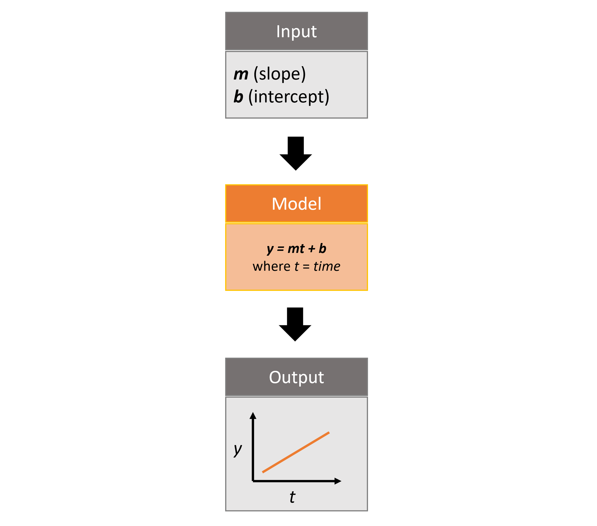

Python Quickstart
=================
Pysyncrosim is the Python interface to [SyncroSim](), a program that structures and models your data. This tutorial will cover the basics of using the Pysyncrosim package within the SyncroSim software framework. To complete this tutorial, you must have installed both [SyncroSim]() and [Pysyncrosim](). You will also need to install the `helloworldTime` SyncroSim Package. 

Overview of SyncroSim
---------------------
SyncroSim is a software platform that helps you turn your data into forecasts. At the core of SyncroSim is an engine that automatically structures your existing data, regardless of its original format. SyncroSim transforms this structured data into forecasts by running it through a Pipeline of calculations (i.e. a suite of models). Finally, SyncroSim provides a rich interface to interact with your data and models, allowing you to explore and track the consequences of alternative “what-if” forecasting Scenarios. Within this software framework is the ability to use and create SyncroSim packages.

For more details consult the SyncroSim online documentation.

Overview of Pysyncrosim
-----------------------
Pysyncrosim is a Python package designed to facilitate the development of modeling workflows for the SyncroSim software framework. Using the Pysyncrosim interface, simulation models can be added and run through SyncroSim to transform Scenario-based datasets into model forecasts. This Python package takes advantage of general features of SyncroSim, such as defining Scenarios with spatial or non-spatial inputs, running Monte Carlo simulations, and summarizing model outputs. Pysyncrosim requires SyncroSim 2.3.6 or higher.

SyncroSim Package: `helloworldTime`
-----------------------------------
`helloworldTime` was designed to be a simple package to show off some key functionalities of SyncroSim, including the ability to add timesteps to SyncroSim modeling workflows.

The package takes from the user 2 inputs, *m* and *b*, representing a slope and an intercept value. It then runs these input values through a linear model, *y=mt+b*, where *t* is *time*, and returns the *y* value as output.

Set Up
------

Install SyncroSim
^^^^^^^^^^^^^^^^^
Before using Pysyncrosim, you will first need to [download and install](https://syncrosim.com/download/) the SyncroSim software. Versions of SyncroSim exist for both Windows and Linux.

Installing and Loading Python Packages
^^^^^^^^^^^^^^^^^^^^^^^^^^^^^^^^^^^^^^
Install `pysyncrosim` using either `conda install` or `pip install`. See the [Installation]() page for more detailed installation instructions.

In a new Python script, import the necessary packages.

.. code-block:: pycon

    >>> import pysyncrosim as ps
    
Connecting Python to SyncroSim 
^^^^^^^^^^^^^^^^^^^^^^^^^^^^^^
The next step in setting up the Python environment for the Pysyncrosim workflow is to create a SyncroSim Session instance in Python that provides the connection to your installed copy of the SyncroSim software. A new Session is created using the Pysyncrosim Session() class. The Session can be initialized with a path to the folder on your computer where SyncroSim has been installed. If no arguments are specified when the Session class is initialized, then the default install folder is used (Windows only).

.. code-block:: pycon

   # Load Session
   >>> mySession = ps.Session()
   
   # Load Session using path to SyncroSim Installation
   >>> mySession = ps.Session(location = "path/to/install_folder")
   
You can check to see which version of SyncroSim your Python script is connected to by running the `version()` method.
 
.. code-block:: pycon
   
   # Check SyncroSim version
   >>> mySession.version() 
   'Version is: 2.3.10'
   
Installing SyncroSim Packages
^^^^^^^^^^^^^^^^^^^^^^^^^^^^^
Finally, check if the `helloworldTime` package is already installed. Use the `package()` method to first get a list of all currently installed SyncroSim Packages.
   
.. code-block:: pycon
   
   # Check which SyncroSim Packages are installed
    >>> mySession.packages()
    Empty DataFrame
    Columns: [index, Name, Description, Version, Extends]
    Index: [] 
    
Currently we do not have any packages installed! To see which packages are available from the SyncroSim package server, you can use the `installed = False` argument in the `package()` method.

.. code-block:: pycon

    # Check out available SyncroSim Packages
    >>> available_packages = mySession.packages(installed=False)
    >>> available_packages.head()
                demosales  \
    0               dgsim   
    1          helloworld   
    2  helloworldPipeline   
    3   helloworldSpatial   
    4      helloworldTime   

      Example SyncroSim Base Package of a very simple sales forecasting model  \
    0     Simulates demographics of wildlife populations                        
    1      Example demonstrating how to create a package                        
    2                            Example using pipelines                        
    3                         Example using spatial data                        
    4                            Example using timesteps                        

       1.1.0  
    0  2.3.0  
    1  1.0.1  
    2  1.0.0  
    3  1.0.2  
    4  1.0.0 
    
Install `helloworldTime` using the `add_package()` method from the Session class. This method takes a Package name as input and then queries the SyncroSim Package server for the specified Package.

.. code-block:: pycon
           
   # Install helloworldTime Package
   >>> mySession.add_packages("helloworldTime")
   ['helloworldTime'] installed successfully
   
To install a package from a `.ssimpkg` file on your local computer rather than installing directly from the server, you can use the Session `add_packages()` method with the `packages` argument set to the filepath to the local Package.
   
.. code-block:: pycon

    # Install helloworldTime Package locally
    >>> mySession.add_packages("path/to/helloworldTime.ssimpkg")

Now `helloworldTime` should be included in the Package list.

.. code-block:: pycon

   >>> mySession.packages()
           index                Name                                   Description Version Extends 
        0      0      helloworldTime    Example demonstrating how to use timesteps   1.0.0     NaN 
        
You can also update or remove a SyncroSim Package from your Session using the :func:`~pysyncrosim.Session.update_packages` function and the :func:`~pysyncrosim.Session.remove_packages` function.

.. code-block:: pycon

   # Update installed packages
   >>> mySession.update_packages("myPackage")
   
   # Remove installed packages 
   >>> mySession.remove_packages("myPackage")
   
Create a Modeling Workflow
--------------------------
When creating a new modeling workflow from scratch, we need to create class instances of the following scopes:

* [Library]()
* [Project]()
* [Scenario]()
   
These classes are hierarchical, such that a Library can contain many Projects, and each Project can contain many Scenarios. All parameters or configurations set in a Library are inherited by all Projects within the Library, and all parameters or configurations set in a Project are inherited by all Scenarios within that Project.

Create a New Library
^^^^^^^^^^^^^^^^^^^^
A SyncroSim Library is a file (with .ssim extension) that stores all of your model inputs and outputs. The format of each SyncroSim Library is unique to the SyncroSim Package with which it is associated. We create a new Library class instance that is connected (through your Session) to a SyncroSim Library file.

.. code-block:: pycon

    # Create a new Library
    >>> myLibrary = ps.library(name = "helloworldLibrary",
    >>>                        session = mySession, 
    >>>                        package = "helloworldTime")
    
    # Check Library information
    >>> myLibrary.info   
                        Property                                       Value  
    0                      Name:                           helloworldLibrary
    1                     Owner:                                         NaN
    2             Last Modified:                       2021-09-10 at 3:13 PM  
    3                      Size:                         196 KB  (200,704 B)
    4                 Read Only:                                          No
    5              Package Name:                              helloworldTime
    6       Package Description:  Example demonstrating how to use timesteps
    7   Current Package Version:                                       1.0.0
    8   Minimum Package Version:                                       1.0.0
    9      External input files:                helloworldLibrary.ssim.input
    10    External output files:               helloworldLibrary.ssim.output
    11          Temporary files:                 helloworldLibrary.ssim.temp
    12             Backup files:               helloworldLibrary.ssim.backup
    
We can also use the ps.library() function to open an existing Library. For instance, now that we have created a Library called “helloworldLibrary.ssim”, we would simply specify that we want to open this Library using the `name` argument.    

.. code-block:: pycon

    # Open existing Library
    >>> myLibrary = ps.library(name = "helloworldLibrary")
                           
Note that if you want to create a new Library file with an existing Library name rather than opening the existing Library, you can use `overwrite=True` when initializing the Library class instance.

Create a New Project
^^^^^^^^^^^^^^^^^^^^
Each SyncroSim Library contains one or more SyncroSim Projects, each represented by an instance of class Project object in Pysyncrosim. Projects typically store model inputs that are common to all your Scenarios. In most situations you will need only a single Project for your Library; by default each new Library starts with a single Project named “Definitions” (with a unique `project_id` = 1). The projects() method of the Libarry class is used to both create and retrieve Projects for a specific Library.

.. code-block:: pycon

    # Create (or open) a Project in this Library
    >>> myProject = myLibrary.projects(name = "Definitions")
    
    # Check Project information
    >>> myProject.info
               Property                   Value
    0         ProjectID                       1
    1              Name             Definitions
    2             Owner                     NaN
    3  DateLastModified  2021-12-21 at 10:48 PM
    4        IsReadOnly                      No
    
Create a New Scenario
^^^^^^^^^^^^^^^^^^^^^
Finally, each SyncroSim Project contains one or more Scenarios, each represented by an instance of class Scenario object in Pysyncrosim.

Scenarios store the specific inputs and outputs associated with each Transformer in SyncroSim. SyncroSim models can be broken down into one or more of these Transformers. Each Transformer essentially runs a series of calculations on the input data to transform it into the output data. Scenarios can contain multiple Transformers connected by a series of Pipelines, such that the output of one Transformer becomes the input of the next.

Each Scenario can be identified by its unique scenario_id. The scenarios() method of class Library or class Project is used to both create and retrieve Scenarios. Note that if using the Library class to generate a new Scenario, you must specify the Project to which the new Scenario belongs if there is more than one Project in the Library.

.. code-block:: pycon

    # Create a new Scenario using the Library class instance
    myScenario = myLibrary.scenarios(name = "My First Scenario")
    
    # Open the newly-created Scenario using the Project class instance
    myScenario = myProject.scenarios(name = "My First Scenario")
    
    # Check Scenario information
    >>> myScenario.info
                  Property                  Value
    0           ScenarioID                      1
    1            ProjectID                      1
    2                 Name      My First Scenario
    3             IsResult                     No
    4             ParentID                    NaN
    5                Owner                    NaN
    6     DateLastModified  2021-09-10 at 3:13 PM
    7           IsReadOnly                     No
    8    MergeDependencies                     No
    9   IgnoreDependencies                    NaN
    10         AutoGenTags                    NaN
    
View Model Inputs
^^^^^^^^^^^^^^^^^
Each SyncroSim Library contains multiple SyncroSim Datasheets. A SyncroSim Datasheet is simply a table of data stored in the Library, and they represent the input and output data for Transformers. Datasheets each have a *scope*: either Library, Project, or Scenario. Datasheets with a Library scope represent data that is specified only once for the entire Library, such as the location of the backup folder. Datasheets with a Project scope represent data that are shared over all Scenarios within a Project. Datasheets with a Scenario scope represent data that must be specified for each generated Scenario. We can view Datasheets of varying scopes using the datasheets() method from the Library, Project, and Scenario classes.

.. code-block:: pycon

    # View a summary of all Datasheets associated with the Scenario
    >>> myScenario.datasheets()
                 Package                                     Name  \
    0  helloworldSpatial         helloworldSpatial_InputDatasheet   
    1  helloworldSpatial  helloworldSpatial_IntermediateDatasheet   
    2  helloworldSpatial        helloworldSpatial_OutputDatasheet   
    3  helloworldSpatial             helloworldSpatial_RunControl   

                Display Name  
    0         InputDatasheet  
    1  IntermediateDatasheet  
    2        OutputDatasheet  
    3            Run Control
    
If we want to see more information about each Datasheet, such as the scope of the Datasheet or if it only accepts a single row of data, we can set the `optional` argument to `True`.    

.. code-block:: pycon
    
    # View detailed summary of all Datasheets associated with a Scenario
    >>> myScenario.datasheets(optional=True)
          Scope            Package                                     Name  \
    0  Scenario  helloworldSpatial         helloworldSpatial_InputDatasheet   
    1  Scenario  helloworldSpatial  helloworldSpatial_IntermediateDatasheet   
    2  Scenario  helloworldSpatial        helloworldSpatial_OutputDatasheet   
    3  Scenario  helloworldSpatial             helloworldSpatial_RunControl   

                Display Name Is Single Is Output  
    0         InputDatasheet       Yes        No  
    1  IntermediateDatasheet        No        No  
    2        OutputDatasheet        No        No  
    3            Run Control       Yes        No 
    
From this output we can see the the `RunControl` Datasheet and `InputDatasheet` only accept a single row of data (i.e. Is Single = Yes). This is something to consider when we configure our model inputs.

To view a specific Datasheet rather than just a data frame of available Datasheets, set the `name` parameter in the `datasheet()` method to the name of the Datasheet you want to view. The general syntax of the name is: “<name of package>_<name of Datasheet>“. From the list of Datasheets above, we can see that there are 4 Datasheets specific to the `helloworldSpatial` package.

.. code-block:: pycon

    # View the input Datasheet for the Scenario
    >>> myScenario.datasheets(name = "helloworldSpatial_InputDatasheet")
    Empty DataFrame
    Columns: [mMean, mSD, InterceptRasterFile]
    Index: []
    
Here, we are viewing the contents of a SyncroSim Datasheet as an Python pandas DataFrame. Although both SyncroSim Datasheets and pandas DataFrames are both represented as tables of data with predefined columns and an unlimited number of rows, the underlying structure of these tables differ.

Configure Model Inputs
^^^^^^^^^^^^^^^^^^^^^^
Currently our input Scenario Datasheets are empty! We need to add some values to our input Datasheet (`InputDatasheet`) and run control Datasheet (`RunControl`) so we can run our model. Since this package also uses pipelines, we also need to add some information to the core `Pipeline` Datasheet to specify which models are run in which order. For more information on using pipelines, see the SyncroSim [Enhancing a Package: Linking Models tutorial]().

Input Datasheet
"""""""""""""""
First, assign the contents of the input Datasheet to a new pandas DataFrame using the Scenario datasheets(), then check the columns that need input values.

.. code-block:: pycon

    # Load input Datasheet to a new pandas DataFrame
    >>> myInputDataframe = myScenario.datasheets(
    >>>     name = "helloworldSpatial_InputDatasheet")
            
    # Check the columns of the input DataFrame
    >>> myInputDataframe.info()
    <class 'pandas.core.frame.DataFrame'>
    RangeIndex: 1 entries, 0 to 0
    Data columns (total 3 columns):
     #   Column               Non-Null Count  Dtype  
    ---  ------               --------------  -----  
     0   mMean                0 non-null      float64
     1   mSD                  0 non-null      float64
     2   InterceptRasterFile  0 non-null      object 
    dtypes: float64(2), object(1)
    memory usage: 152.0+ bytes
    
The input Datasheet requires three values:

* `mMean` : the mean of a normal distribution that will determine the slope of the linear equation.
* `mSD` : the standard deviation of a normal distribution that will determine the slope of the linear equation.
* `InterceptRasterFile` : the file path to a *raster image*, in which each cell of the image will be an intercept in the linear equation.

In this example, the external file we are using for the InterceptRasterFile is a simple 5x5 raster TIF file. The file used in this tutorial can be found [here](https://github.com/ApexRMS/helloworldSpatial/blob/main/images/input-raster.tif).

Add these values of a Python dictionary, then append them to `myInputDataframe`.

.. code-block:: pycon

    # Create input data dictionary
    >>> myInputDict = {"mMean": 0, "mSD": 4,
    >>>                "InterceptRasterFile": "path/to/raster-image.tif"}
                   
    # Append input data dictionary to myInputDataframe
    >>> myInputDataFrame = myInputDataframe.append(myInputDict,
    >>>                                            ignore_index=True)
    
    # Check values
    >>> myInputDataFrame
       mMean   mSD       InterceptRasterFile
    0    0.0   4.0  path/to/raster-image.tif
    
Finally, save the updated pandas DataFrame to a SyncroSim Datasheet using the `save_datasheet()` method.

.. code-block:: pycon

    >>> myScenario.save_datasheet(name = "helloworldSpatial_InputDatasheet",
    >>>                           data = myInputDataframe)
    
RunControl Datasheet
""""""""""""""""""""

The `RunControl` Datasheet sets the number of iterations and the minimum and maximum time steps for our model. We’ll assign the contents of this Datasheet to a new pandas DataFrame as well and then update the information in the DataFrame with a Python dictionary. We need to specify data for the following four columns:

* `MinimumIteration` : starting value of iterations (default=1).
* `MaximumIteration` : total number of iterations to run the model for.
* `MinimumTimestep` : the starting time point of the simulation.
* `MaximumTimestep` : the end time point of the simulation.

.. code-block:: pycon

    # Load RunControl Datasheet to a pandas DataFrame
    >>> runSettings = myScenario.datasheets(
    >>>     name = "helloworldSpatial_RunControl")
    
    # Check the columns of the RunControl DataFrame
    >>> runSettings.info()
    <class 'pandas.core.frame.DataFrame'>
    RangeIndex: 1 entries, 0 to 0
    Data columns (total 4 columns):
     #   Column            Non-Null Count  Dtype
    ---  ------            --------------  -----
     0   MinimumIteration  0 non-null      int64
     1   MaximumIteration  0 non-null      int64
     2   MinimumTimestep   0 non-null      int64
     3   MaximumTimestep   0 non-null      int64
    dtypes: int64(4)
    memory usage: 160.0 bytes
    
    # Create RunControl data dictionary
    >>> runControlDict = {"MinimumIteration": 1,
    >>>                   "MaximumIteration": 5,
    >>>                   "MinimumTimestep": 1,
    >>>                   "MaximumTimestep": 10}
    
    # Append RunControl data dictionary to RunControl DataFrame
    >>> runSettings = runSettings.append(runControlDict, ignore_index=True)
    
    # Check values
    >>> runSettings
       MinimumIteration  MaximumIteration  MinimumTimestep  MaximumTimestep
    0                 1                 5                1               10
    
    # Save RunControl pandas DataFrame to a SyncroSim Datasheet
    >>> myScenario.save_datasheet(name = "helloworldSpatial_RunControl",
    >>>                           data = runSettings)
    
    
Pipeline Datasheet
""""""""""""""""""

The `helloworldSpatial` Package also makes use of pipelines to link the output of one model to the input of a second model. To learn more about pipelines, see the SyncroSim [Enhancing a Package: Linking Models tutorial](https://docs.syncrosim.com/how_to_guides/package_create_pipelines.html).

To implement pipelines, we need to specify the order in which to run the Transformers (i.e. models) in our pipeline by editing the `Pipeline` Datasheet. The `Pipeline` Datasheet is part of the built-in SyncroSim core, so we access it using the "core_" prefix with the `datasheets()` method. 

.. code-block:: pycon

    # Load Pipeline Datasheet to a pandas DataFrame
    >>> myPipelineDataframe = myScenario.datasheets(name = "core_Pipeline")
    
    # Check the columns of the Pipeline DataFrame
    >>> myPipelineDataframe.info()
    <class 'pandas.core.frame.DataFrame'>
    RangeIndex: 2 entries, 0 to 1
    Data columns (total 3 columns):
     #   Column       Non-Null Count  Dtype  
    ---  ------       --------------  -----  
     0   StageNameID  0 non-null      object 
     1   MaximumJobs  0 non-null      float64
     2   RunOrder     0 non-null      int64  
    dtypes: float64(1), int64(1), object(1)
    memory usage: 176.0+ bytes
    
The `Pipeline` Datasheet has the column `StageNameID` which corresponds to the names of the models: "First Model" and "Second Model". We will set the data for this Datasheet such that "First Model" is run first, then "Second Model". This way, the output from "First Model" is used as the input for "Second Model".

.. code-block:: pycon

    # Create Pipeline data dictionary
    >>> pipelineDict = pd.DataFrame({"StageNameID": ["First Model",
    >>>                                              "Second Model"],
    >>>                              "RunOrder": [1, 2]})
    
    # Append Pipeline data dictionary to Pipeline DataFrame
    >>> myPipelineDataframe = myPipelineDataframe.append(pipelineDict)
    
    # Check values
    >>> myPipelineDataframe
        StageNameID MaximumJobs RunOrder
    0   First Model         NaN        1
    1  Second Model         NaN        2
    
    # Save Pipeline pandas DataFrame to a SyncroSim Datasheet
    >>> myScenario.save_datasheet(name = "core_Pipeline", 
    >>>                           data = myPipelineDataframe)
    
Run Scenarios
-------------

Setting Run Parameters
^^^^^^^^^^^^^^^^^^^^^^

We will now run our Scenario using the Scenario `run()` method. If we have a large modeling workflow and we want to parallelize the run using multiprocessing, we can set the `jobs` argument to be a value greater than one.

.. code-block:: pycon

    # Run the Scenario using 5 jobs
    >>> myResultsScenario = myScenario.run(jobs=5)
    