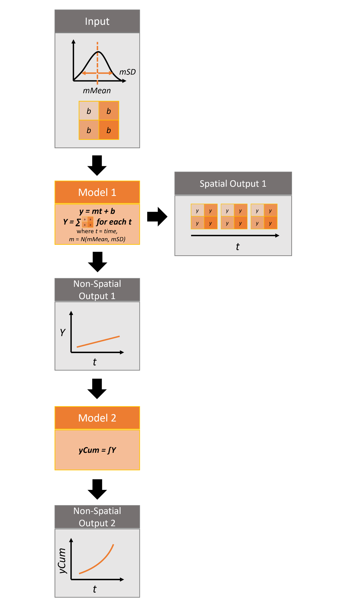

Python Quickstart
=================
Pysyncrosim is the Python interface to [SyncroSim](), a program that structures and models your data, turning it into valuable forecasts. This tutorial assumes you have already [installed Pysyncrosim](). For this tutorial, you will need to install the `helloworldSpatial` SyncroSim Package. `helloworldSpatial` was designed to be a simple package to show off some key functionalities of SyncroSim, including the ability to use both spatial and non-spatial data.

The Package takes 3 inputs, *mMean*, *mSD*, and a spatial raster file of intercept (*b*) values. For each iteration, a value *m*, representing the slope, is sampled from a normal distribution with mean of *mMean* and standard deviation of *mSD*. These values are run through 2 models to produce both spatial and non-spatial outputs.

Set Up Environment
------------------
First, import all packages necessary for the tutorial. In addition to `pysyncrosim`, you will need `pandas`, `rasterio`, and `matplotlib`.

.. code-block:: pycon

    >>> import pandas as pd
    >>> import os
    >>> import rasterio
    >>> from matplotlib import pyplot
    >>> import pysyncrosim as ps
    
Next, load a SyncroSim Session and ensure you have the necessary SyncroSim Package installed. 

.. code-block:: pycon

   # Load Session
   >>> mySession = ps.Session()
   
   # Check SyncroSim version
   >>> mySession.version() 
   'Version is: 2.3.10'
   
   # Check which SyncroSim Packages are installed
   >>> mySession.packages()
           index                   Name                                      Description Version Extends 
           
   # Install helloworldSpatial Package
   >>> mySession.add_packages("helloworldSpatial")
   ['helloworldSpatial'] installed successfully
   
   >>> mySession.packages()
           index                   Name                                      Description Version Extends 
        0      0      helloworldSpatial    Example demonstrating how to use spatial data   1.0.2     NaN 
        
You can also update or remove a SyncroSim Package from your Session using the :func:`~pysyncrosim.Session.update_packages` function and the :func:`~pysyncrosim.Session.remove_packages` function.

.. code-block:: pycon

   # Update installed packages
   >>> mySession.update_packages("myPackage")
   
   # Remove installed packages 
   >>> mySession.remove_packages("myPackage")
   
Create a Modeling Workflow
--------------------------
To begin creating the modeling workflow, we need to specify a SyncroSim Library, Project, and Scenario. 
   