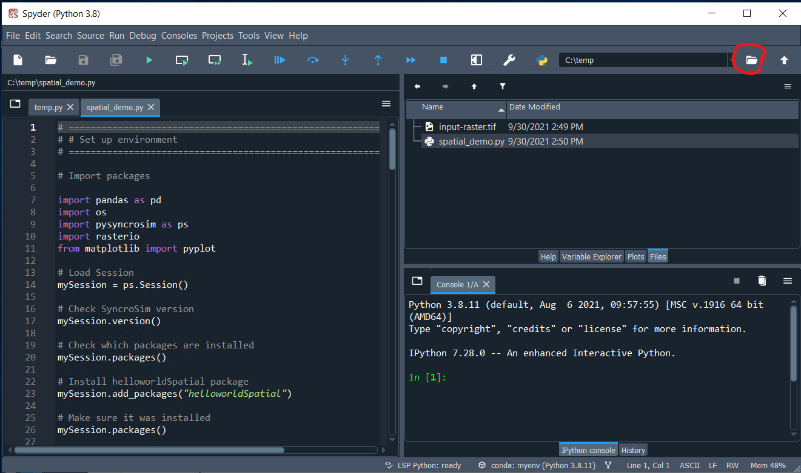

Running Pysyncrosim in Spyder
=============================

If using ``conda``, the ``spyder`` IDE is easy to install and straightforward to use.

1. First, install ``spyder`` either in your base environment or in your ``conda`` environment using the following code.

.. code-block:: console

	# Install spyder
	conda install spyder

2. Open the IDE by typing ``spyder`` in the command prompt.

.. code-block:: console

	# Open spyder
	spyder

.. note::

	you may get a pop-up saying you have a missing dependency, ``rtree``. You can safely ignore this warning.

3. Within the IDE, change the working directory to the directory containing your pysyncrosim scripts (e.g. `spatial_demo.py`_ and `input-raster.tif`_)

	.. _spatial_demo.py: https://github.com/syncrosim/pysyncrosim/blob/main/examples/spatial_demo.py
	.. _input-raster.tif: https://github.com/syncrosim/pysyncrosim/blob/main/examples/input-raster.tif

|

4. Open and run your pysyncrosim scripts from the left-hand window. You can run scripts line-by-line in ``spyder`` by selecting the line(s) you want to run and pressing F9.
